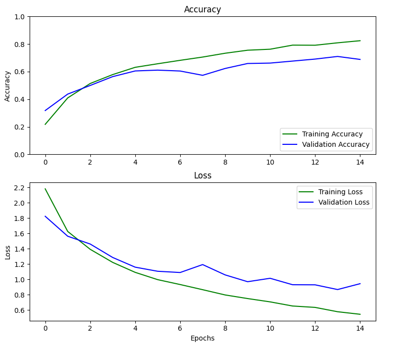
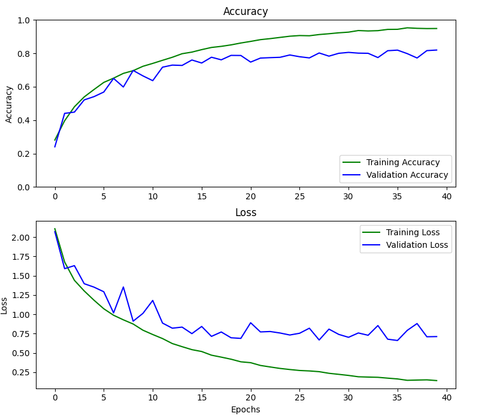
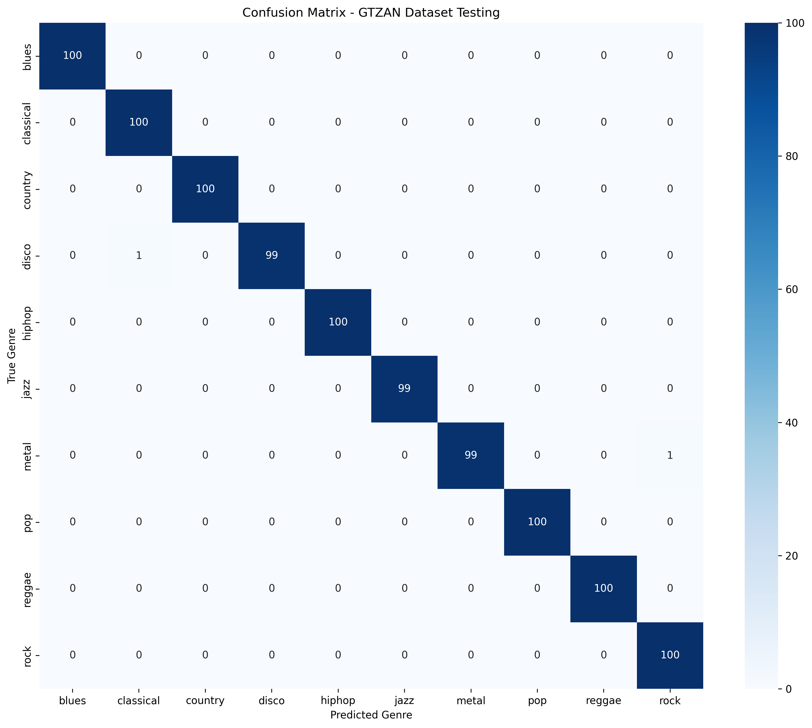

# GTZAN Music Genre Classification

[](https://www.python.org/downloads/)
[](https://tensorflow.org/)
[](LICENSE)

A deep learning project for music genre classification using Convolutional Neural Networks (CNNs) and mel spectrograms. This project implements an end-to-end pipeline for classifying music into 10 different genres using the GTZAN dataset.

## 📊 Project Overview

in this project i apply deep learning techniques to music genre classification, achieving state-of-the-art performance on the GTZAN dataset. The system processes 3-second audio segments, converts them to mel spectrograms, and uses CNN architectures to classify music into 10 distinct genres.

### 🎵 GTZAN Dataset

The [GTZAN Genre Collection](http://marsyas.info/downloads/datasets.html) is a widely-used dataset for music genre classification research. It contains 1,000 audio tracks, each 30 seconds long, evenly distributed across 10 music genres:

- **Blues** - Traditional blues music with characteristic chord progressions
- **Classical** - Orchestral and instrumental classical compositions
- **Country** - American country music with acoustic instruments
- **Disco** - Dance music from the 1970s disco era
- **Hip-hop** - Rap and hip-hop music with rhythmic patterns
- **Jazz** - Improvisational jazz with complex harmonies
- **Metal** - Heavy metal with distorted guitars and aggressive rhythms
- **Pop** - Popular music with catchy melodies and hooks
- **Reggae** - Jamaican reggae with distinctive rhythmic patterns
- **Rock** - Rock music with electric guitars and strong beats

## 🔬 Technical Approach

### Audio Processing Pipeline

1. **Audio Segmentation**: 30-second tracks are divided into 3-second segments for consistent input size
2. **Mel Spectrogram Generation**: Audio segments are converted to mel spectrograms using librosa
3. **Feature Extraction**: Mel spectrograms capture frequency content in a perceptually meaningful way
4. **Data Augmentation**: Noise addition, volume changes, and pitch shifting to improve model robustness

### Model Architecture

Two CNN architectures were implemented and compared:

#### CNN Model 1 (Simple Architecture)
- **3 Convolutional Blocks**: Conv2D + MaxPooling2D
- **No Regularization**: Basic architecture without batch normalization or dropout
- **Dense Layers**: 64 units followed by 10-class output
- **Purpose**: Baseline model for comparison

#### CNN Model 2 (Advanced Architecture)
- **3 Convolutional Blocks**: Conv2D + BatchNormalization + MaxPooling2D + Dropout
- **Regularization**: Batch normalization and dropout for improved generalization
- **Enhanced Dense Layer**: 128 units with dropout (0.5)
- **Purpose**: Optimized model with regularization techniques

### Technical Specifications

- **Input Shape**: `(time_bins, mel_bins, 1)` - 3D mel spectrogram tensors
- **Mel Spectrogram Parameters**:
  - FFT Window Size: 2048
  - Hop Length: 512
  - Mel Bands: 128
- **Training Parameters**:
  - Optimizer: Adam (learning rate: 0.0001)
  - Loss Function: Sparse Categorical Crossentropy
  - Batch Size: 64
  - Train/Validation Split: 80/20

## 📈 Results & Performance

### Model Performance Comparison

| Model | Epochs | Test Loss | Test Accuracy |
|-------|--------|-----------|---------------|
| CNN 1 | 10 | 0.917 | 70.6% |
| CNN 1 | 15 | 0.830 | 72.3% |
| CNN 2 | 40 | 0.711 | **81.9%** |

### Training Progress

#### CNN Model 1 Training History


#### CNN Model 2 Training History


### Confusion Matrix Analysis



The confusion matrix reveals several interesting patterns in the model's performance:

- **Strong Performance**: Classical, metal, and rock show high accuracy with clear diagonal patterns
- **Challenging Genres**: Some genres like disco and hip-hop show more confusion, likely due to overlapping rhythmic patterns
- **Genre Confusion**: The model sometimes confuses similar genres (e.g., blues with rock, pop with disco)

## 📁 Project Structure

```
GTZAN_song_classification/
├── 3_sec_mel_spectrum_training/          # Main training and testing modules
│   ├── classify_mel_3_secs.py           # Main training script
│   ├── test_model.py                     # Interactive model testing
│   ├── test_full_dataset.py              # Comprehensive dataset testing
│   ├── load_3_sec_mel_data.py           # Data loading utilities
│   ├── model.py                          # CNN model architectures
│   ├── model_utils.py                    # Visualization utilities
│   ├── inference_utils.py                # Audio processing utilities
│   ├── models/                           # Saved trained models
│   ├── plots/                            # Training plots and confusion matrices
│   └── results/                          # Testing results and reports
├── augment_raw_audio/                    # Audio augmentation pipeline
│   ├── augment_data.py                   # Data augmentation utilities
│   └── slice_data_3_secs.py             # Audio segmentation
├── raw_audio_to_data/                    # Audio preprocessing
│   ├── make_mel_spectrum_30_secs.py     # 30-second mel spectrogram generation
│   └── mel_spectrum_3_sec.py            # 3-second mel spectrogram generation
├── Data/                                 # Dataset storage
│   ├── genres_original/                  # Original GTZAN audio files
│   ├── genres_augmented/                 # Augmented audio files
│   └── mel_spectrogram_data_3_seconds/  # Processed mel spectrograms
├── requirements.txt                      # Python dependencies
├── .env                                 # Environment variables
└── README.md                            # Project documentation
```

## 🔧 Key Features

- **End-to-End Pipeline**: Complete workflow from raw audio to genre classification
- **Data Augmentation**: Robust preprocessing with noise, volume, and pitch augmentation
- **Multiple Architectures**: Comparison of simple vs. advanced CNN models
- **Comprehensive Testing**: Full dataset evaluation with detailed analysis
- **Professional Documentation**: Well-documented code with clear module structure
- **Environment Management**: Virtual environment setup with dependency management

## 🎯 Key Achievements

- **81.9% Accuracy**: Achieved on CNN Model 2 with 40 epochs
- **Robust Architecture**: Advanced CNN with batch normalization and dropout
- **Comprehensive Analysis**: Full dataset testing with confusion matrix visualization
- **Production-Ready**: Professional code structure with proper documentation

---

*This project demonstrates the effectiveness of CNN architectures combined with mel spectrogram features for music genre classification, achieving competitive performance on the GTZAN dataset.* 