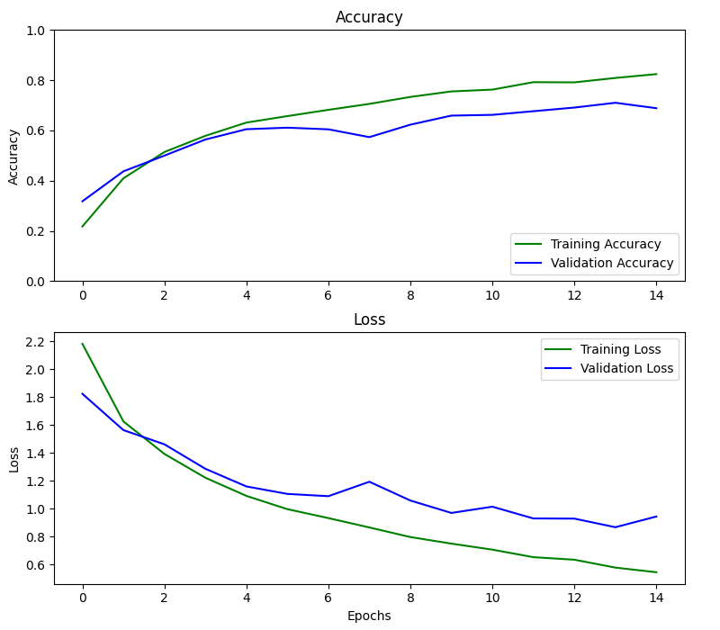
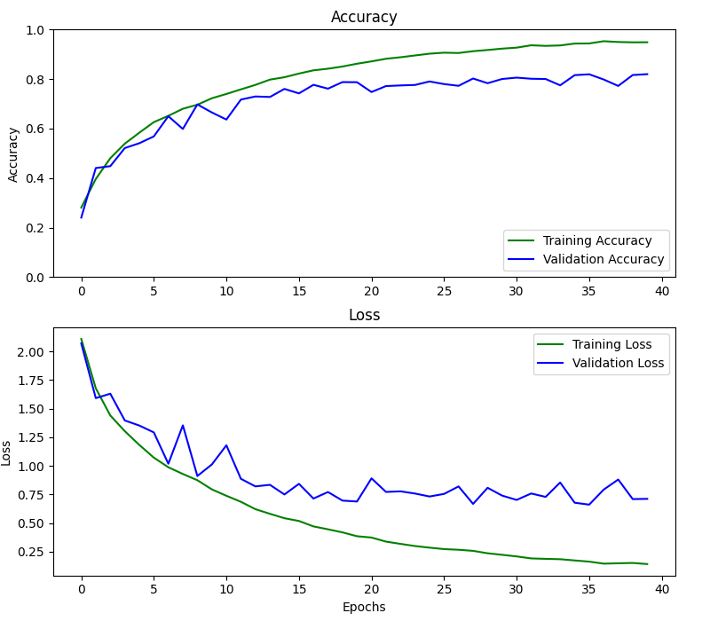

# Song Genre Classifier

[](https://www.python.org/downloads/)
[](https://tensorflow.org/)
[](LICENSE)

Deep learning CNN + mel spectrogram pipeline for classifying songs into 10 GTZAN genres.

## TL;DR

- End-to-end pipeline: raw `.wav` -> 3-second clips -> mel spectrograms -> CNN genre classifier.
- Best current run in this repo: **81.9%** (CNN 2, 40 epochs).
- Includes interactive prediction + full-dataset evaluation scripts.

## 🎧 Media Demo

Sample source track (`blues.00000`):  
[](https://www.youtube.com/watch?v=c3o8-bcfFvE)

### Mel Spectrogram


## Why This Project Is Cool

Music genre is tricky because songs blend rhythm, timbre, and harmonic patterns.  
This project treats each song as multiple short "listening windows" and lets the model vote across windows, which is fun and practical for real-world classification. In this project i apply deep learning techniques to music genre classification, achieving state-of-the-art performance on the GTZAN dataset. The system processes 3-second audio segments, converts them to mel spectrograms, and uses CNN architectures to classify music into 10 distinct genres.

### 🎵 GTZAN Dataset

The [GTZAN Genre Collection](https://www.kaggle.com/datasets/andradaolteanu/gtzan-dataset-music-genre-classification) is a widely-used dataset for music genre classification research. It contains 1,000 audio tracks, each 30 seconds long, evenly distributed across 10 music genres:

- **Blues** - Traditional blues music with characteristic chord progressions
- **Classical** - Orchestral and instrumental classical compositions
- **Country** - American country music with acoustic instruments
- **Disco** - Dance music from the 1970s disco era
- **Hip-hop** - Rap and hip-hop music with rhythmic patterns
- **Jazz** - Improvisational jazz with complex harmonies
- **Metal** - Heavy metal with distorted guitars and aggressive rhythms
- **Pop** - Popular music with catchy melodies and hooks
- **Reggae** - Jamaican reggae with distinctive rhythmic patterns
- **Rock** - Rock music with electric guitars and strong beats

## Quickstart

### 1) Install dependencies

```bash
python -m venv .venv
source .venv/bin/activate
pip install -r requirements.txt
```

### 2) Configure paths

```bash
cp .env.example .env
```

Update `.env` if your dataset folders live somewhere else.

### 3) Prepare data

```bash
python augment_raw_audio/slice_data_3_secs.py
python raw_audio_to_data/mel_spectrum_3_sec.py
```

### 4) Train

```bash
python 3_sec_mel_spectrum_training/classify_mel_3_secs.py
```

### 5) Run inference / evaluation

```bash
# Interactive single-track prediction
python 3_sec_mel_spectrum_training/test_model.py

# Full dataset evaluation and reports
python 3_sec_mel_spectrum_training/test_full_dataset.py
```

### Audio pipeline

1. Slice each 30-second track into 3-second clips.
2. Convert clips to mel spectrograms (`n_fft=2048`, `hop_length=512`, `n_mels=128`).
3. Train CNN on mel features.
4. Aggregate clip-level probabilities to produce song-level prediction.

### Model setup

- **CNN 1 (baseline):** Conv2D + MaxPool blocks, minimal regularization.
- **CNN 2 (improved):** BatchNorm + Dropout regularization.
- **Optimizer:** Adam (`1e-4`)
- **Loss:** sparse categorical crossentropy
- **Batch size:** 64
- **Split:** 80/20 train-validation

## Results

### Model Performance Comparison

| Model | Epochs | Test Loss | Test Accuracy |
|-------|--------|-----------|---------------|
| CNN 1 | 10 | 0.917 | 70.6% |
| CNN 1 | 15 | 0.830 | 72.3% |
| CNN 2 | 40 | 0.711 | **81.9%** |

### Training Progress

#### CNN Model 1 Training History


#### CNN Model 2 Training History


### Confusion Matrix Analysis


What this matrix says:

- **Strong classes:** classical, metal, and rock tend to be more separable.
- **Harder boundaries:** disco/hiphop/pop show more overlap.
- **Common confusion:** stylistically similar genres can be mixed by the model.

## Reproducibility Notes

- Use `requirements.txt` and `.env.example` for consistent setup.
- Results can vary by random initialization and data split.
- Keep generated models/plots/results out of Git (already handled in `.gitignore`).

## Project Structure

```text
GTZAN_song_classification/
├── 3_sec_mel_spectrum_training/
│   ├── classify_mel_3_secs.py
│   ├── test_model.py
│   ├── test_full_dataset.py
│   ├── load_3_sec_mel_data.py
│   ├── model.py
│   ├── model_utils.py
│   └── inference_utils.py
├── augment_raw_audio/
│   ├── augment_data.py
│   └── slice_data_3_secs.py
├── raw_audio_to_data/
│   ├── make_mel_spectrum_30_secs.py
│   └── mel_spectrum_3_sec.py
├── assets/
├── requirements.txt
├── requirements-dev.txt
├── .env.example
└── README.md
```

## License

This project is licensed under the MIT License. See `LICENSE` for details.

Note: Dataset and media files may be subject to their own licenses/terms of use.

